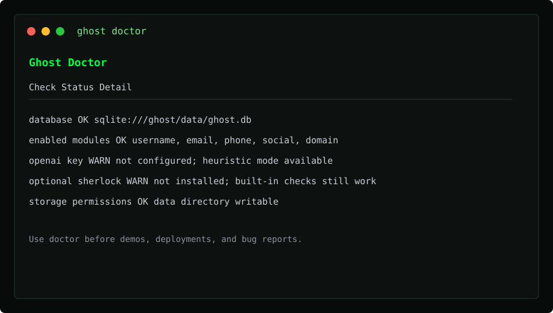
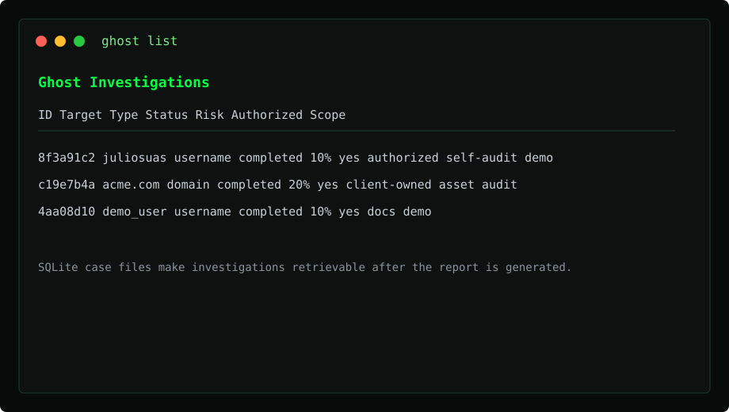
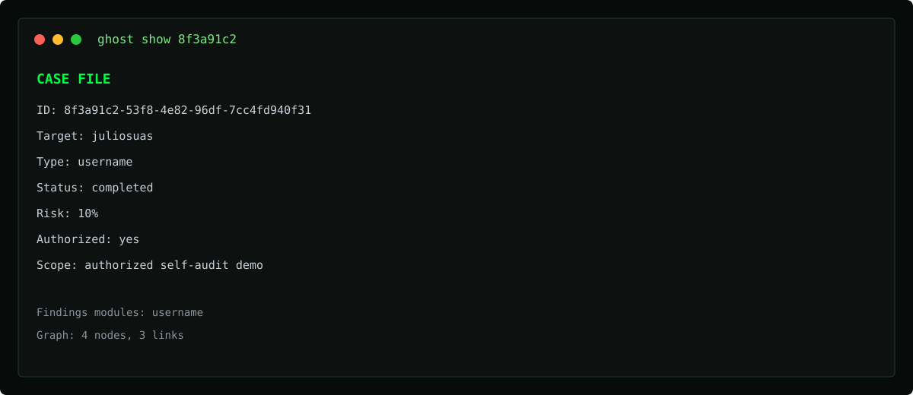

<div align="center">

# 👻 GHOST

### Local authorized OSINT case files + provenance

[](https://python.org)
[](LICENSE)
[](#installation)
[](https://github.com/juliosuas/ghost/actions/workflows/ci.yml)
[](https://github.com/juliosuas/ghost/stargazers)
[](https://github.com/juliosuas/ghost/issues)

**A local case-file workspace for authorized self-audits — SQLite storage, scope/authorization, and report provenance. Not a SaaS. Not an "AI platform."**

[Quick Start](#-60-second-quick-start) · [Features](#-features) · [Installation](#-installation) · [Demo](docs/self-audit-demo.md) · [Roadmap](#-roadmap) · [Contributing](#-contributing)

---

*Run an authorized local investigation from a single target (username, email, phone, domain, or photo), store it as a case file, and keep a provenance trail of what ran and where evidence came from. OpenAI is optional (`--no-ai` is the Quick Start path).*

</div>

## 🔍 Why Ghost?

Ghost is a **case-file workspace** for authorized OSINT — not a drop-in replacement for a username hunter like [maigret](https://github.com/soxoj/maigret).

Maigret (and Sherlock) are excellent at asking "does this handle exist on hundreds or thousands of sites?" Ghost's job is different: take a **single authorized target**, run the modules you choose, store a **SQLite case file** with scope and authorization, and emit a **report with provenance** (what ran, which source URLs were collected, what failed).

| | Ghost | maigret alone |
|---|---|---|
| **Durable case files** | SQLite investigations with `ghost list` / `show` / `export` / `import` | Collection reports, not a Ghost-style case store |
| **Authorization + scope** | Recorded on the case and in report provenance (`--authorized`, `--scope`) | Not a first-class case-file field |
| **Multi-vector modules** | Username, email, phone, domain, image, social, darkweb, geolocation | Username-focused |
| **Username coverage** | 70 built-in HTTP presence checks; optional Sherlock if installed | Thousands of sites with deeper per-site checks |
| **Optional AI correlation** | OpenAI when configured; `--no-ai` uses deterministic heuristics | No |
| **Local readiness** | `ghost doctor` / `--json` (fails closed on insecure server defaults) | No |

Use maigret or Sherlock when you need the widest username hunt. Use Ghost when you need that evidence stored as a defensible investigation you can retrieve, export, and hand off.

The built-in username module is an HTTP status check against 70 platforms. It can shell out to Sherlock when the binary is on `PATH`. It does not wrap maigret.

Compared with general OSINT suites (Maltego, SpiderFoot, Recon-ng), Ghost's current wedge is **local, authorized case files + provenance**, not "more transforms than everyone else." The REST API and graph JSON exist today; a dashboard HTML UI is **not shipped** yet. HTML/JSON reports always work; PDF needs the optional `weasyprint` extra.

## 📸 Screenshots

A terminal demo GIF belongs at [`docs/screenshots/demo.gif`](docs/screenshots/demo.gif) once captured from the [self-audit walkthrough](docs/self-audit-demo.md). That file is not in the repo yet (placeholder path only — see [`docs/screenshots/README.md`](docs/screenshots/README.md)). Until then, these SVG captures show the CLI:

<div align="center">
  
  
  <br>
  
</div>

## ✨ Features

### Investigation Vectors

| Module | Description | Status |
|---|---|:---:|
| 🔤 **Username Enumeration** | 70 built-in HTTP presence checks; optional Sherlock expands coverage | ✅ |
| 📧 **Email Intelligence** | Validation, MX, Gravatar; HIBP when `HIBP_API_KEY` is set | ✅ |
| 📱 **Phone OSINT** | Carrier lookup, location, social media association | ✅ |
| 🌐 **Domain Recon** | WHOIS, DNS, subdomains, tech stack, SSL, Wayback | ✅ |
| 🖼️ **Image Analysis** | EXIF + hashes; reverse-search URLs; face detection if `face_recognition` is installed | ✅ |
| 🕵️ **Social Media Deep Dive** | Experimental HTTP probes (Instagram, X, Reddit, TikTok, GitHub, LinkedIn). Not a full API-backed deep dive; **not a Quick Start default**. | ⚠️ experimental |
| 🌑 **Dark Web Monitoring** | Experimental Ahmia / paste / HIBP probes. Not a monitoring product; **not a Quick Start default**. | ⚠️ experimental |

### Intelligence Engine

- 🤖 **Optional AI correlation** — OpenAI analysis only when `OPENAI_API_KEY` is set; `--no-ai` uses deterministic heuristics
- 📊 **Risk Assessment** — Heuristic scoring always; richer profiling when OpenAI is configured
- 🧩 **Entity Resolution** — Connects findings into graph-ready entities in SQLite
- 📈 **Timeline Analysis** — Heuristic event list from module output

### Output & Reporting

- 📄 **Reports** — HTML and JSON always; PDF when the optional `weasyprint` extra is installed
- 🗺️ **Entity graph API** — D3-compatible JSON at `/api/investigation/<id>/graph` (dashboard HTML is not shipped yet)
- 🖥️ **CLI** — Rich interface, `ghost doctor`, and case-file commands (`list`, `show`, `export`, `import`, `delete`)
- 🔌 **REST API** — Flask at `python -m ghost.backend.server` (loopback by default). Case-data routes require `GHOST_API_TOKEN`; `authorized_use: true` is still required as case-file policy.

## ⚡ 60-second Quick Start

Authorized self-audit, no OpenAI key, no extra OSINT binaries. Copy-paste:

```bash
git clone https://github.com/juliosuas/ghost.git
cd ghost
python3 -m pip install -e .
python3 -m ghost doctor
python3 -m ghost investigate demo_user \
  --type username \
  --modules username \
  --no-ai \
  --authorized \
  --scope "authorized self-audit demo" \
  --format json \
  --output demo-report.json
python3 -m ghost list
```

`python3 -m ghost` is the supported entrypoint (`ghost/__main__.py`). After `pip install -e .`, the `ghost` console script from `pyproject.toml` is equivalent.

`ghost doctor` checks SQLite, optional keys, module imports, and **exposure gates**. On a fresh clone it exits **1** until `GHOST_SECRET_KEY` and `GHOST_API_TOKEN` are set (and `GHOST_HOST`, if set, is `127.0.0.1` or `localhost`). That does **not** block the `investigate` command below — CLI-only self-audit never starts Flask. See [Configuration](#-configuration).

The investigate command stores a case in SQLite and writes `demo-report.json` with a `provenance` block. Redacted sample output lives in [`examples/`](examples/). Quick Start uses `--modules username` only; social and darkweb collectors are experimental and are not part of this path.

Use only an authorized target (your own handle, or a synthetic name like `demo_user`). Full walkthrough: [authorized self-audit demo](docs/self-audit-demo.md).

More CLI: `ghost show <id-prefix>`, `ghost export`, `ghost import`, `ghost delete`, or `python3 -m ghost` with no arguments for the interactive menu.

## 📦 Installation

### From source (supported)

```bash
git clone https://github.com/juliosuas/ghost.git
cd ghost
python3 -m pip install -e .
# optional: python3 -m pip install -e ".[dev]"   # pytest + ruff, matches CI
# optional: cp .env.example .env                 # only if you need OpenAI or extra APIs
```

`requirements.txt` is a broader dependency pin used by the Docker image. For local CLI work, the editable install above is the path CI and the `ghost` script expect.

### PyPI

`pip install ghost-osint` is **not published yet**. The package name in `pyproject.toml` is `ghost-osint`; install from source until a GitHub release is tagged (see [CHANGELOG.md](CHANGELOG.md)).

### Docker

```bash
git clone https://github.com/juliosuas/ghost.git
cd ghost
cp .env.example .env   # set GHOST_SECRET_KEY and GHOST_API_TOKEN; required by env_file
docker-compose up -d
# REST API → http://127.0.0.1:5000  (published on loopback only; dashboard HTML is not shipped)
```

## 🔧 Configuration

Copy `.env.example` to `.env` and add your API keys:

| Key | Service | Required | Notes |
|---|---|:---:|---|
| `GHOST_SECRET_KEY` | Flask signing key | For `ghost doctor` / starting the API | Doctor **fails** if missing or equal to `ghost-dev-key`. API refuses to start without a real secret (outside debug). CLI-only investigate does not need it. |
| `GHOST_HOST` | Flask bind address | No (unset = CLI-only OK) | Doctor **fails** if set off-loopback. Code default is `127.0.0.1`. |
| `GHOST_API_TOKEN` | API token | For `ghost doctor` / Flask `/api/*` | Doctor **fails** if empty. Send `Authorization: Bearer <token>` or `X-Ghost-Token`. `/api/health` is the only unauthenticated API route. |
| `OPENAI_API_KEY` | Optional LLM analysis | No (`--no-ai` / heuristic fallback) | Not part of Quick Start. |
| `HIBP_API_KEY` | Have I Been Pwned | No | Paid API. |
| `SHODAN_API_KEY` | Shodan | No | Free tier available. |
| `GOOGLE_CX` / `GOOGLE_API_KEY` | Google Custom Search | No | Free tier available. |
| `TWITTER_BEARER_TOKEN` | Twitter/X API | No | Free tier available. |
| `IPINFO_TOKEN` | IP Geolocation | No | Free tier available. |

`ghost doctor` and `ghost doctor --json` exit non-zero when any exposure gate fails (`ok: false` in JSON, with `checks[].name` equal to the env var). Setting these variables is **not** required to run `ghost investigate --authorized --no-ai`. Do not start `python -m ghost.backend.server` until doctor is green.

### Storage

Ghost v2 stores investigations, findings, entities, and graph relationships in
SQLite by default instead of JSON files. This gives local users durable,
queryable storage without requiring a separate database server.

```env
DATABASE_URL=sqlite:///./ghost/data/ghost.db
```

PostgreSQL is on the roadmap behind the storage adapter boundary. For now,
non-SQLite `DATABASE_URL` values fail explicitly so deployments do not silently
write data to the wrong place.

See the [storage adapter boundary](docs/storage-adapter-boundary.md) for the
contract Ghost must satisfy before advertising non-SQLite backends.

> **Note:** OpenAI is optional. `--no-ai` (and a missing key) uses heuristic summaries. Additional keys unlock more modules (HIBP, Shodan, Google CSE, and so on).

## 📖 Usage

### Python API

```python
from ghost.core.investigator import GhostInvestigator

investigator = GhostInvestigator()
investigation = investigator.investigate(
    "demo_user",
    input_type="username",
    modules=["username"],
    scope="authorized self-audit",
    authorized_use=True,
)
report_path = investigator.generate_report(investigation, format="json", output_path="demo-report.json")
```

### REST API

```bash
# Start the server (refuses to bind without GHOST_SECRET_KEY + GHOST_API_TOKEN)
python -m ghost.backend.server

# Submit an investigation
curl -X POST http://127.0.0.1:5000/api/investigate \
  -H "Content-Type: application/json" \
  -H "Authorization: Bearer $GHOST_API_TOKEN" \
  -d '{"target": "demo_user", "input_type": "username", "authorized_use": true, "scope": "authorized self-audit"}'
```

## 🏗️ Architecture

```
.
├── ghost/           # Python package (`ghost` / `python -m ghost`)
│   ├── core/        # Orchestration, doctor checks, reports
│   ├── modules/     # OSINT collectors (username, email, phone, …)
│   ├── ai/          # Optional LLM analysis; heuristic fallback
│   ├── ui/          # Rich CLI
│   ├── backend/     # Flask REST API and SQLite case store
│   └── templates/   # HTML report templates
├── examples/        # Redacted sample case + expected report snippet
├── docs/            # Self-audit demo, storage contract, screenshots
└── tests/           # pytest suite (CI)
```

## 🗺️ Roadmap

- [ ] **Plugin System** — Drop-in custom modules with standard interface
- [ ] **Geospatial Timeline** — Map-based activity visualization over time
- [ ] **Team Collaboration** — Multi-user investigations with shared workspaces
- [ ] **Telegram Bot** — Run investigations from Telegram
- [ ] **Export to STIX/TAXII** — Threat intelligence format compatibility
- [ ] **Graph Database** — Neo4j backend for complex relationship mapping
- [ ] **Mobile App** — iOS/Android companion for field investigations
- [ ] **Scheduled Monitoring** — Continuous target monitoring with alerts

## 🤝 Contributing

Contributions are welcome! Here's how to get started:

1. **Fork** the repository
2. **Create** a feature branch: `git checkout -b feature/amazing-module`
3. **Commit** your changes: `git commit -m "Add amazing module"`
4. **Push** to the branch: `git push origin feature/amazing-module`
5. **Open** a Pull Request

CI runs Ruff and pytest on Python 3.10, 3.11, and 3.12. PRs should include proof plus screenshots or terminal output when user-facing behavior changes.

Good first issues and docs questions have templates under [`.github/ISSUE_TEMPLATE/`](.github/ISSUE_TEMPLATE/). Please do not include private target data.

### Areas We Need Help

- 🌍 **New OSINT modules** — More platforms, more data sources
- 🧪 **Testing** — Unit tests, integration tests, edge cases
- 📝 **Documentation** — Guides, tutorials, API docs
- 🎨 **Dashboard UI** — First HTML frontend for the existing graph API
- 🌐 **Translations** — i18n support for global users

## 💬 Community

- [GitHub Discussions](https://github.com/juliosuas/ghost/discussions) — Questions, ideas, show & tell
- [GitHub Issues](https://github.com/juliosuas/ghost/issues) — Bug reports & feature requests

## ⚠️ Legal Disclaimer

> **This tool is provided for authorized security research, journalism, law enforcement, and personal use only.**

By using Ghost, you agree to the following:

- You are **solely responsible** for ensuring your use complies with all applicable local, state, national, and international laws
- **Unauthorized surveillance, stalking, or harassment is illegal** and unethical
- Always obtain proper authorization before investigating individuals
- Data collected may be subject to **GDPR, CCPA**, and other privacy regulations
- The developers assume **no liability** for misuse of this tool

**Ghost must NOT be used to:**

| ❌ Prohibited Use |
|---|
| Stalk, harass, or intimidate any person |
| Violate any person's reasonable expectation of privacy |
| Conduct unauthorized surveillance |
| Bypass access controls or terms of service |
| Engage in any illegal activity |

*If you are unsure whether your use case is lawful, consult a legal professional before proceeding.*

## 📄 License

MIT License — see [LICENSE](LICENSE) for details.

---

<div align="center">

**Built with 👻 by [Julio](https://github.com/juliosuas)**

*If Ghost helps your work, consider giving it a ⭐*

</div>

---
### 🌱 Also check out
**[AI Garden](https://github.com/juliosuas/ai-garden)** — A living world built exclusively by AI agents. Watch it grow.
