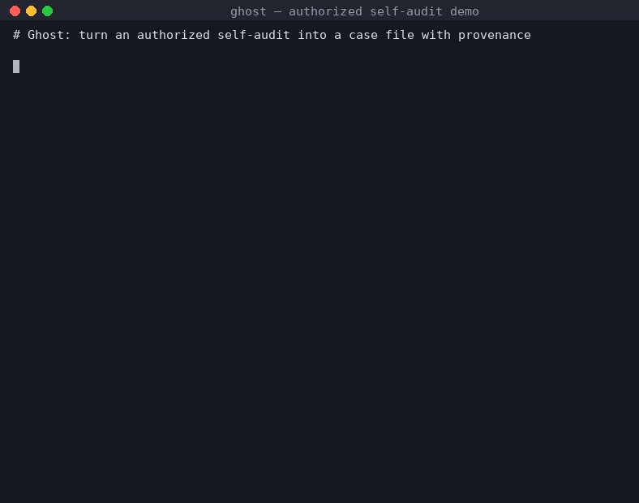

# Ghost

**Sherlock finds accounts. Ghost turns them into a case file you can defend.**

The evidence and case-file layer for authorized OSINT and self-audits. One local SQLite case, a recorded scope, and a provenance block on the report.

[](https://github.com/juliosuas/ghost/actions/workflows/ci.yml)
[](https://github.com/juliosuas/ghost/blob/main/.github/workflows/ci.yml)
[](LICENSE)

[Quick start](#quick-start) · [Why Ghost](#why-ghost) · [Comparison](#ghost-next-to-sherlock-and-maigret) · [Coming next](#coming-next) · [Ethics and scope](#ethics-and-scope) · [Contributing](#contributing)

<p align="center">
  
</p>

The GIF is the synthetic sample case: `import`, `list`, `show`, `export`. No live lookups. It lands with [#24](https://github.com/juliosuas/ghost/pull/24) at `docs/screenshots/demo.gif`. Until that pull request merges, the image above is not in this branch.

## Quick start

Python 3.10 or newer. These three commands install Ghost from the default branch, store the synthetic sample, and export it. They do not contact any site.

```bash
pipx install git+https://github.com/juliosuas/ghost
# doctor creates the SQLite schema, then exits 1 until API secrets are set
ghost doctor || true; curl -fsSL -o demo-case.json https://raw.githubusercontent.com/juliosuas/ghost/main/examples/sample-username-case.json && ghost import demo-case.json
ghost export a1b2c3d4 --output exported-case.json
```

The sample target is `demo_user` (id prefix `a1b2c3d4`). Profile URLs are `*.example.com` placeholders. See [`examples/README.md`](examples/README.md). Importing that same id again needs `ghost import demo-case.json --replace`.

`ghost doctor` is in the second command because a fresh database has no tables until doctor (or the API process) runs `init_db`. On a fresh install it exits 1: `GHOST_SECRET_KEY` and `GHOST_API_TOKEN` are unset. Those variables gate the API. The case commands leave Flask stopped, so the `|| true` is enough to continue.

A live self-audit, on your own handle, is `ghost investigate YOUR_HANDLE --type username --modules username --no-ai --authorized --scope "authorized self-audit demo" --format json --output demo-report.json`, then `ghost import demo-report.json`. `investigate` writes the report file. `import` inserts the SQLite row that `export` reads. `--authorized` records a flag on the case. Permission has to exist before you run it. Walkthrough: [authorized self-audit demo](docs/self-audit-demo.md).

The database file is `ghost/data/ghost.db` inside the installed package. A `pipx` reinstall can remove it. To keep the file, set an absolute URL such as `DATABASE_URL=sqlite:////home/me/ghost.db`. A home data directory is [#25](https://github.com/juliosuas/ghost/pull/25), listed under [Coming next](#coming-next).

There is no PyPI release. The name in `pyproject.toml` is `ghost-osint`.

## Why Ghost

- **Provenance.** HTML and JSON reports include a provenance block: generation time, target, input type, case id, scope, `authorized_use`, modules that ran, the http(s) source URLs taken from findings, and module or global errors.
- **sha256 on image bytes.** The image module stores md5 and sha256 of the file it loaded, next to EXIF when that can be read. SHA-256 of an imported Sherlock, Maigret, or Holehe file is part of [#27](https://github.com/juliosuas/ghost/pull/27), which is not in this release.
- **Exports.** `ghost export` writes one saved case as JSON. `ghost import` loads it back. Reports are HTML and JSON. PDF is written when the optional `weasyprint` extra is installed; otherwise the HTML report is the file you get.
- **Local-first.** Cases live in SQLite on the machine that runs Ghost. `--no-ai` skips OpenAI and uses the heuristic summary. The Flask API binds to `127.0.0.1` and requires `GHOST_API_TOKEN` on case routes. The shipped HTML is the investigation report. Version 0.1.0.

## Ghost next to Sherlock and Maigret

[Sherlock](https://github.com/sherlock-project/sherlock) and [Maigret](https://github.com/soxoj/maigret) are the username hunters. Ghost is the case file you keep after a hunt you were allowed to run. Use them for coverage. Use Ghost when you need the result stored with scope, authorization, and a report you can hand someone.

| | Sherlock or Maigret | What Ghost adds |
|---|---|---|
| **Finding accounts** | Sherlock's README describes 400+ social networks and a text file per username (CSV and XLSX optional). Maigret's README describes about 5,900 sites, a default run of the top 500, profile details, and HTML, JSON, PDF, CSV, and other reports. | 70 built-in HTTP presence checks. If a `sherlock` binary is on `PATH`, the username module also runs it. Ghost does not call Maigret. |
| **What you keep** | The tool's own report files. | A SQLite case with target, scope, and `authorized_use`, then `ghost list`, `show`, `export`, and `import`. `investigate` writes the report file; `import` is what inserts the row. The API can insert a row too, and it requires `authorized_use: true`. |
| **Provenance** | You keep the output those tools already write. | The HTML/JSON report adds the provenance block described above, including source URLs and errors. |
| **Other targets** | Username. [Holehe](https://github.com/megadose/holehe) is the separate email-to-account check. | Email, phone, domain, image, and geolocation modules. Social and darkweb collectors stay off unless you pass `--modules social` or `--modules darkweb`. |

Importing a Sherlock, Maigret, or Holehe output file directly is not in this release. That command is [#27](https://github.com/juliosuas/ghost/pull/27).

## Coming next

Open pull requests. These commands and paths are not in the tree this README describes.

- [#25](https://github.com/juliosuas/ghost/pull/25) — `GHOST_HOME` data directory, so the SQLite file and reports live outside the install tree. Precedence planned there: `DATABASE_URL`, then `GHOST_HOME`, then a user data directory.
- [#27](https://github.com/juliosuas/ghost/pull/27) — `ghost ingest FILE --tool {sherlock,maigret,holehe}` reads a local report into a case. It does not run a lookup. Each imported record is planned to carry the tool name and a SHA-256 of the source file.

## Ethics and scope

Ghost is for authorized security research, journalism, law enforcement, and self-audits. You are responsible for complying with the law where you run it. Unauthorized surveillance, stalking, and harassment are illegal.

The quick start uses synthetic data only. A live `ghost investigate` sends HTTP requests to the sites in the username list (70 built-in checks, and Sherlock too when that binary is installed). Run it on your own accounts, or on a target you have permission to audit.

This is a local, single-user case file (0.1.0, alpha). Out of scope: a plugin system, geospatial timeline, team collaboration, a Telegram bot, STIX/TAXII export, a graph database, a mobile app, and scheduled monitoring. PostgreSQL is not supported; non-SQLite `DATABASE_URL` values fail explicitly. The contract is the [storage adapter boundary](docs/storage-adapter-boundary.md).

Welcome work: reliability, tests, documentation, and honest calibration of the collectors that already exist.

## Contributing

CI runs Ruff and pytest on Python 3.10, 3.11, and 3.12.

```bash
git clone https://github.com/juliosuas/ghost.git
cd ghost
python3 -m pip install -e ".[dev]"
python3 -m pytest -q
```

- [Issue templates](.github/ISSUE_TEMPLATE/) for bugs, docs questions, and good first issues
- [Pull request template](.github/pull_request_template.md)
- [Authorized self-audit demo](docs/self-audit-demo.md)
- [Synthetic samples](examples/README.md)
- [Storage adapter boundary](docs/storage-adapter-boundary.md)

Leave private target data out of issues and pull requests.

## License

MIT. See [LICENSE](LICENSE).
